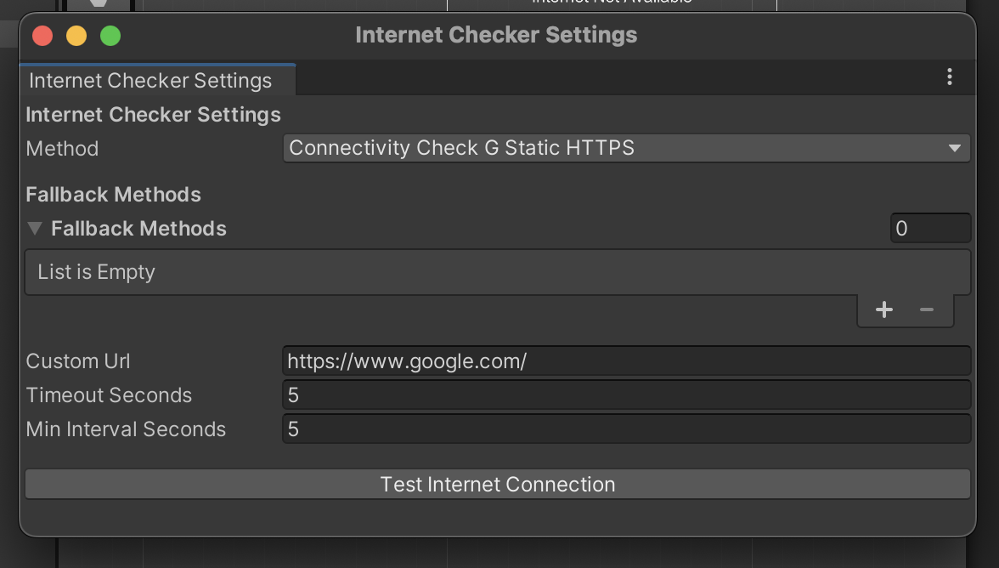

# InternetChecker Unity Plugin

## 🔧 Getting Started: Setup InternetChecker

### Step 1: Open the Settings Window

In the Unity Editor, go to:

> **Tools → Network → Internet Checker Settings**

You should see a window pop up like this:



---

### Step 2: Create or Load the Configuration Asset

If the configuration file does not already exist, the plugin will automatically create one at:

```
Assets/EasyAssets/Settings/InternetChecker/InternetCheckerSettings.asset
```

---

### Step 3: Configure Internet Checking Options

- Select your **primary method** (e.g., `Google204`, `Apple`, etc.)
- Add **fallback methods** as backup
- Customize parameters:
  - `Timeout (seconds)`
  - `Cache interval (seconds)`
  - `Custom URL` (only used when `Custom` method is selected)

Use the **“Test Internet Connection”** button to instantly test your configuration.

---

### Step 4: Using the Singleton InternetCheckManager

The `InternetCheckManager` is now a Singleton. You can access it from anywhere using:

```csharp
var manager = InternetCheckManager.Instance;
```

You do not need to assign it manually in the scene anymore — just make sure it exists once in your scene.

Example usage:

```csharp
private async void Start()
{
    bool isConnected = await InternetCheckManager.Instance.IsInternetAvailable();
    Debug.Log("Internet: " + isConnected);
}
```

Or using coroutine:

```csharp
private void Start()
{
    StartCoroutine(CheckConnection());
}

private IEnumerator CheckConnection()
{
    yield return CoroutineTaskExtensions.WaitForTask(
        InternetCheckManager.Instance.IsInternetAvailable(),
        result => Debug.Log("Internet available: " + result)
    );
}
```

---

Now you're ready to use InternetChecker anywhere in your game with `InternetCheckManager.Instance`!
