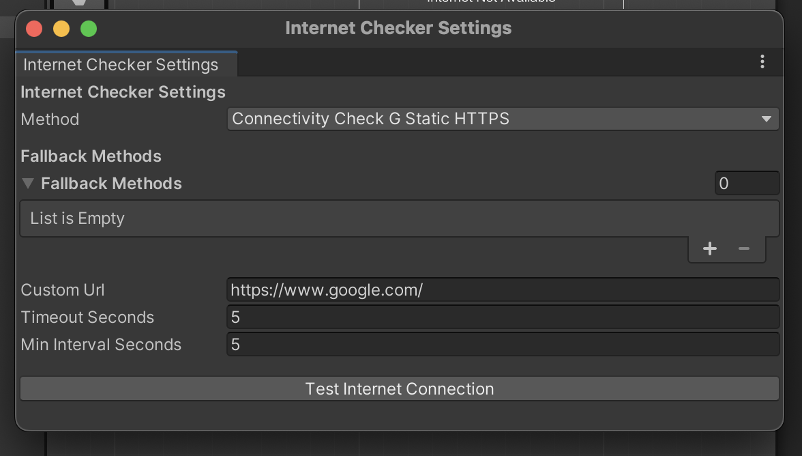

# InternetChecker Unity Plugin

InternetChecker is a lightweight Unity plugin that allows you to verify actual internet connectivity — not just network connection — by using multiple captive portal detection methods (Google204, Apple, MicrosoftNCSI, etc.). It helps avoid false positives from local Wi-Fi and detects when a captive portal is blocking internet access.

---

## 📦 Install via Unity Package Manager

To install InternetChecker as a Git-based package, add the following line to your `Packages/manifest.json` file:

```json
{
  "dependencies": {
    "ez-internet-checker": "https://github.com/easy-assets/ez-internet-checker.git#v1.0.0"
  }
}
```

> ✅ This fetches the plugin from GitHub and adds it to your Unity project automatically.

---

## ⚙️ Quick Start Guide

### Step 1: Open the Settings Window

In Unity Editor, go to:

> **Tools → Network → Internet Checker Settings**

You should see a window like this:



---

### Step 2: Create or Load the Configuration Asset

If no configuration file exists, the plugin will automatically create one at:

```
Assets/Settings/Network/InternetCheckerSettings.asset
```

This file stores your detection method, fallbacks, and timeout settings.

---

### Step 3: Configure Checking Options

- Select your **Primary Method** (e.g., `Google204`, `Apple`)
- Add any **Fallback Methods**
- Customize:
  - `Timeout (seconds)`
  - `Cache Interval (seconds)`
  - `Custom URL` (if using `Custom` method)

Click **“Test Internet Connection”** in the editor to verify your setup.

---

## 🚀 Runtime Usage

The `InternetCheckManager` is a Singleton.

### Access it from anywhere:

```csharp
var manager = InternetCheckManager.Instance;
```

> Make sure a single `InternetCheckManager` exists in your scene. You don’t need to assign the settings manually — the instance will use the configured `InternetCheckerSettings.asset`.

---

### 🔁 Example: Async Check

```csharp
private async void Start()
{
    bool isConnected = await InternetCheckManager.Instance.IsInternetAvailable();
    Debug.Log("Internet: " + isConnected);
}
```

### 🔄 Example: Coroutine Check

```csharp
private void Start()
{
    StartCoroutine(CheckConnection());
}

private IEnumerator CheckConnection()
{
    yield return CoroutineTaskExtensions.WaitForTask(
        InternetCheckManager.Instance.IsInternetAvailable(),
        result => Debug.Log("Internet available: " + result)
    );
}
```

---

## 🛠 Features

- ✅ Detect real internet connectivity (not just local network)
- 🌐 Supports 16 detection methods:
  - Google204 / GoogleBlank
  - Apple / Apple HTTPS
  - MicrosoftNCSI / ConnectTest
  - Ubuntu
  - Custom URLs
- 🚫 Detects captive portals (e.g., hotel login pages)
- 🔁 Method fallback support
- 🧠 Internal caching to reduce network calls
- 🎮 UnityEvent callback support (`OnInternetStatusChecked`)

---

## 📁 Default Asset Location

- InternetCheckerSettings:  
  `Assets/Settings/InternetChecker/InternetCheckerSettings.asset`

---

Now you're ready to use InternetChecker reliably in your Unity games!

